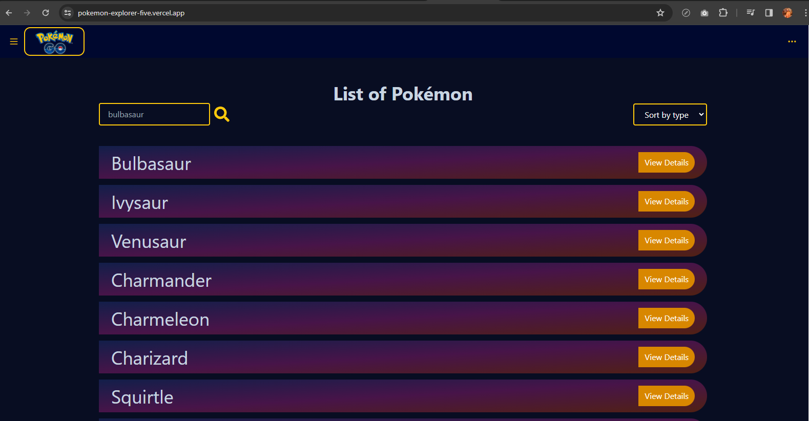
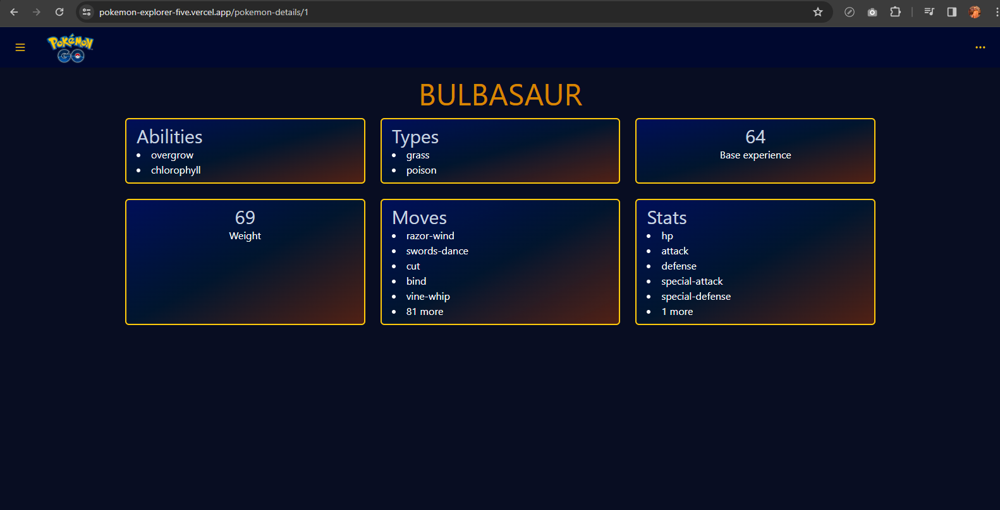

# Pokémon Explorer
This project is made for details information about Pokémon. You can check details by clicking view details button. And you can go home page by clicking website logo.





This template provides a minimal setup to get React working in Vite with HMR and some ESLint rules.
Currently, two official plugins are available:
- [@vitejs/plugin-react](https://github.com/vitejs/vite-plugin-react/blob/main/packages/plugin-react/README.md) uses [Babel](https://babeljs.io/) for Fast Refresh
- [@vitejs/plugin-react-swc](https://github.com/vitejs/vite-plugin-react-swc) uses [SWC](https://swc.rs/) for Fast Refresh

## Local installation
```
npm install
```
```
npm run dev
```

### Live site: https://pokemon-explorer-five.vercel.app/